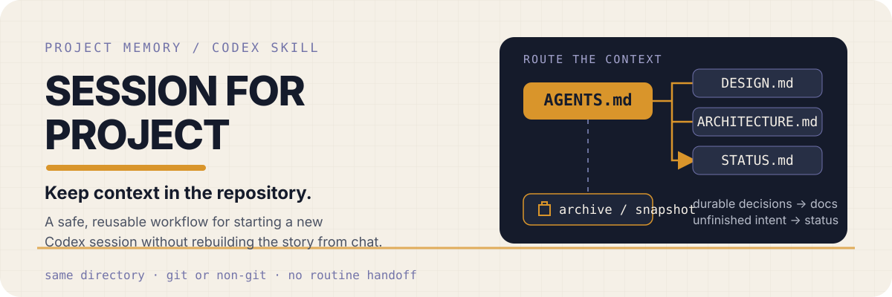
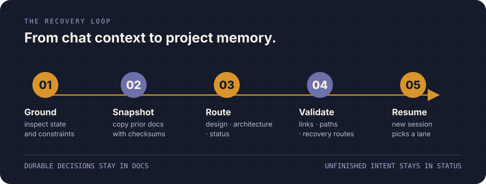

<p align="center">
  
</p>

<p align="center">
  <strong>一个用于整理项目长期记忆的可复用 Codex Skill。</strong><br />
  重要里程碑之后，让新 Session 不依赖 handoff 也能恢复项目。
</p>

<p align="center">
  <a href="./README.md">English</a> ·
  <a href="./README.zh-CN.md">简体中文</a>
</p>

<p align="center">
  <a href="#解决什么问题">解决什么问题</a> ·
  <a href="#什么时候使用">什么时候使用</a> ·
  <a href="#工作方式">工作方式</a> ·
  <a href="#安装">安装</a>
</p>

## 解决什么问题

`session-for-project` 面向已经成形的项目：项目完成重要里程碑、经历大重构，或用户明确要求治理项目长期记忆之后，整理一组小而可审计的项目本地指针与文档，让 fresh Session 不依赖聊天记录或 handoff 即可恢复已核实的稳定事实。

文档结构随项目实际复杂度变化，而不是固定模板：

- 只有 agent 工作流需要长期路由时，才保留或建立 `AGENTS.md` router。
- 只有存在已核实的长期事实时，才建立设计、架构、领域、ADR 或状态文档。
- 已有健康的文档结构继续作为权威，不为了 canonical path 重命名或复制。
- 对当前干净且已提交的 tracked 文档依赖 Git 历史；对 Git 无法安全恢复的 untracked、临时、外部或经明确授权的 dirty 内容，才做归档保护。

Git、Issue 和 Roadmap 仍是普通开发中的主要连续性来源。这个 Skill 是一次有意触发的项目长期记忆刷新，不是每个 Session 都必须经过的流程。

## 什么时候使用

只有在用户明确要求建立、刷新、合并或治理项目长期记忆时才运行，例如：

```text
$session-for-project 为这个成熟项目整理长期记忆
$session-for-project 大重构完成后，把稳定事实沉淀到项目文档
$session-for-project 把已有 handoff 吸收到正式项目记忆
```

Issue、Roadmap、PRD、普通 Session 切换、一次性 handoff 或 chat compaction 都走正常开发流程。如果未完成工作必须跨 Session 且包含未提交的 continuity 信息，优先使用一次性 handoff 或临时保留现场。只有明确要求把这些材料吸收到正式项目记忆时，才适合运行本 Skill。

验收边界很明确：成熟项目里程碑后的记忆刷新应执行；Issue 完成后准备开启 fresh Session 不应执行；带 dirty continuity 的未完成工作应转为 handoff 或临时保留现场。

## 工作方式

<p align="center">
  
</p>

流程带有明确入口，并按需生成：

1. 确认用户的长期项目记忆意图，以及里程碑、大重构或合并原因。
2. 根据当前文件、指令、配置和工作区状态建立事实基线。
3. 依据项目复杂度选择真正需要的记忆文档。
4. 对干净的已提交文件使用 Git 历史，对 Git 无法安全恢复的来源创建快照。
5. 验收链接、路径、dirty 状态保护、schema 决策和 3 个场景。

## 安装

将这个仓库克隆到 Codex Skill 目录：

```bash
git clone git@github.com:zj-linjie/session-for-project.git "${CODEX_HOME:-$HOME/.codex}/skills/session-for-project"
```

如果目录已经存在，则直接更新：

```bash
git -C "${CODEX_HOME:-$HOME/.codex}/skills/session-for-project" pull --ff-only
```

仓库包含 Skill 入口、文档契约和 README/视觉层；它不会安装依赖，也不会修改项目代码。

## 文档选择

没有强制四件套。一个项目可能只需要现有的指令文件、一个 router，或一个聚焦的权威文档：

| 需求 | 文档 | 判定 |
|---|---|---|
| Agent 路由 | `AGENTS.md` 或现有指令文件 | 只有确实需要路由时保留或新增 |
| 稳定产品或视觉事实 | 设计权威文档 | 按需 |
| 运行时、数据、工作流或部署事实 | 架构权威文档 | 按需 |
| 无法从常规来源恢复的未完成意图 | `STATUS.md` 或等价文档 | 按需 |
| 复杂领域语义或持久化决策理由 | 领域文档或 ADR | 按需 |

不存在对应需求时，就让文档保持不存在。简单项目不能因为运行了这个 Skill 就被制造出空的 DESIGN 或 ARCHITECTURE 占位文件。

## 安全模型

### 优先依赖 Git 历史

对于当前版本干净且已经提交的 tracked 文件，在报告中记录修改前 commit SHA、路径和原因，并通过 Git 恢复旧版本；不再在 `docs/archive/session-memory/` 中重复创建完整快照。

带未提交改动的 tracked 文件保持原样，除非用户明确授权吸收或重组；获得授权后，先创建 focused diff 或精确备份。Untracked、临时、外部或即将移动的来源在修改前仍需创建精确、经过校验和验证的快照。

工具加载的指令文件保留其 live role。已有 dirty 改动、发布状态、部署状态和外部系统不在本流程的授权范围内。

### 同目录边界

记忆文档属于项目本地。被忽略的草稿、未提交改动和机器本地素材不会自动跟随到另一个 Git worktree 或另一台电脑；Skill 会记录这一限制，而不是隐藏它。

## 职责边界

| 工具或来源 | 职责 |
|---|---|
| Session Docter | Context 成本健康、审计、修复和新项目 bootstrap |
| `session-for-project` | 已成形项目的长期 project-memory 整理与刷新 |
| Handoff | 一个未完成任务在两个 Session 之间的一次性临时转移 |
| Git / Issue / Roadmap | 普通开发中的主要连续性来源 |

## 仓库结构

```text
SKILL.md                              # 面向模型的入口与触发边界
agents/openai.yaml                   # Codex UI 元数据
references/document-contract.md      # schema、历史策略与验收规则
assets/readme/                        # README 视觉资源与可编辑 SVG 源文件
```

## 明确不会做什么

- 不会让每个 Session 都经过项目记忆审计。
- 不会替代 Git、Issue、Roadmap、一次性 handoff 或 chat compaction。
- 不会强迫所有项目采用 `AGENTS.md` 加 DESIGN/ARCHITECTURE/STATUS 占位文件。
- 不会在未保留原有规则的情况下替换项目正在生效的指令文件。
- 不会编造架构、设计决策、测试、采用情况或兼容性声明。
- 不会在建立记忆时发布内容、部署网站、提交代码或推送改动。
- 不会自动清理或删除现有项目文档。

## 许可证

这个仓库目前尚未声明许可证。
